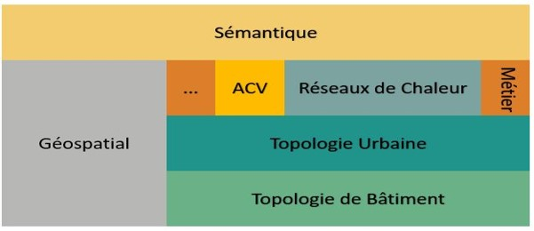
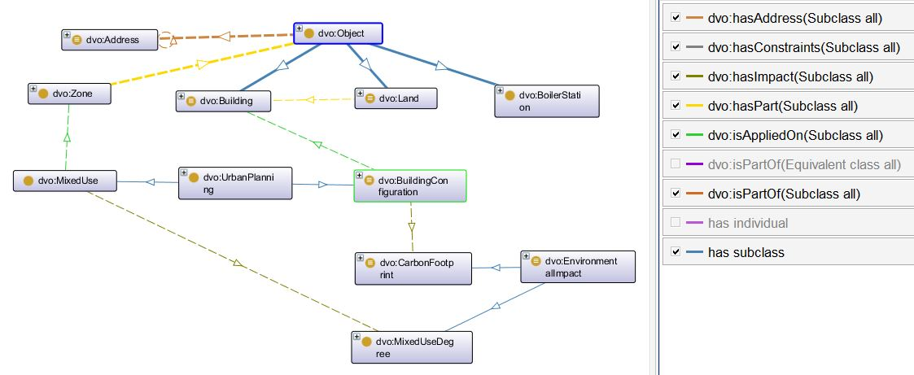

**DataView Ontology (dvo)**

DataView Ontology defines core concepts and relations for urban data used by *Nobatek/INEF4* tools for environmental and energy assessments such as lifecyle assessments of sustainable territories and decision support evaluations for the design of optimal district heating.
It encapsulates common vocabularies among these tools as well as vocabularies from open and public urban data sources (such as *INSEE* and *Open StreetMap*).

The ontology is multi-layered. It encapsulates 5 main layers:
- The building layer
- The urban layer
- The domain-specific layer comprising 2 sub-layers so far: the LifeCycle Assessment (LCA) layer and the District Heating (DH) layer
- The geospatial layer
- The semantic layer

The figure below depicts core concepts and relations of DataView Ontology:

The ontology is aligned with other existing ontologies such as:
- [ifcOWL](https://standards.buildingsmart.org/IFC/DEV/IFC4/ADD2_TC1/OWL/ontology.ttl)
- [cityGMLOWL](http://cui.unige.ch/isi/onto/citygml2.0.owl) 
- [SEMANCO](http://semanco-tools.eu/ontology-releases/eu/semanco/ontology/SEMANCO/SEMANCO.owl) 
- [LCA Pattern](http://descartes-core.org/ontologies/lca/1.0/LCAPattern.owl) 

