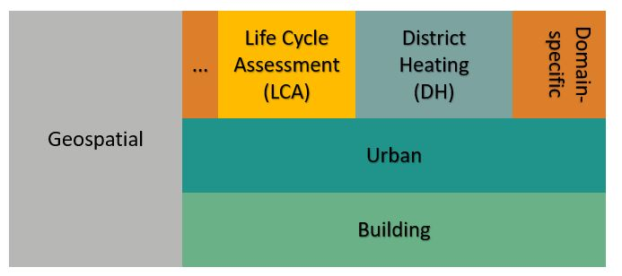

**DataView Ontology (dvo)**

DataView Ontology defines core concepts and relations for urban data used by *Nobatek/INEF4* tools for environmental and energy assessments such as lifecyle assessments of sustainable territories and decision support evaluations for the design of optimal district heating.
It encapsulates common vocabularies among these tools as well as vocabularies from open and public urban data sources (such as *INSEE* and *Open StreetMap*).

The ontology is multi-layered. It encapsulates 4 main layers:
- The building layer, which contains concepts and relations describing a building and its related  characteristics (e.g., usage, typology, construction type, energy source for heating and hot water, energy performance, etc.) ;
- The urban layer, which contains concepts and relations describing urban objects such buildings, boiler stations, lands, etc. and related zones ;
- The domain-specific layer comprising 2 sub-layers so far: 
    - The LifeCycle Assessment (LCA) layer, which contains concepts and relations describing urban planning activities (e.g., building configuration, mixed use study, etc.) and related environmental impacts (e.g., carbon footprint, mixed use degree, etc.) ;
    - The District Heating (DH) layer, which describes a boiler station and its related characteritics (e.g., energy source, length,power, carbon footprint) ;
- The geospatial layer, which contains concepts and relations describing address information (e.g., name, code, gps coordinates, city, country, etc.) related to an urban object or a zone. 

The figure below depicts core concepts and relations of DataView Ontology:

The ontology is aligned with other existing ontologies such as:
- [ifcOWL](https://standards.buildingsmart.org/IFC/DEV/IFC4/ADD2_TC1/OWL/ontology.ttl)
- [cityGMLOWL](http://cui.unige.ch/isi/onto/citygml2.0.owl) 
- [SEMANCO](http://semanco-tools.eu/ontology-releases/eu/semanco/ontology/SEMANCO/SEMANCO.owl) 
- [LCA Pattern](http://descartes-core.org/ontologies/lca/1.0/LCAPattern.owl) 

